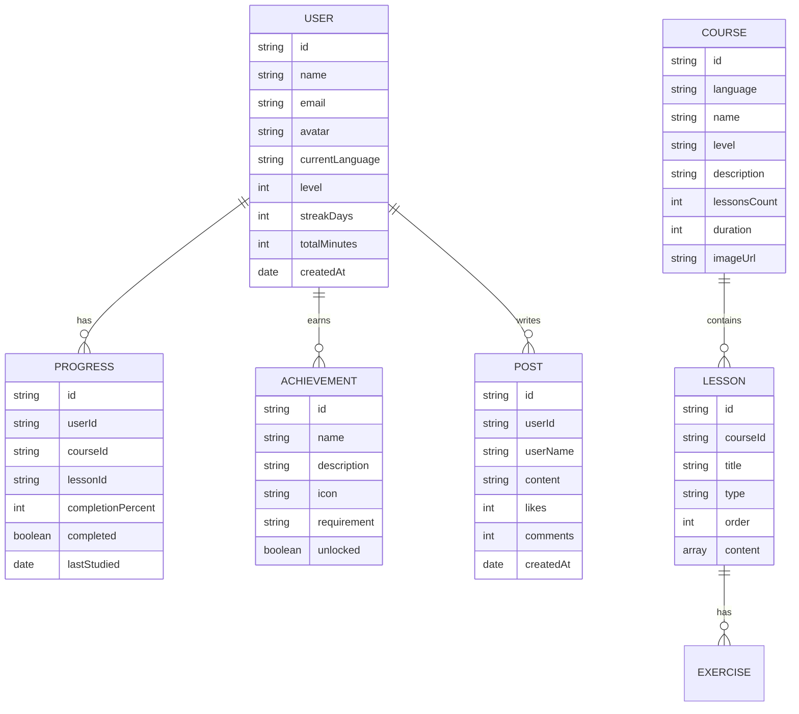

## 1. Architecture Design

```mermaid
graph TB
    A[前端 React] --&gt; B[状态管理 Zustand]
    A --&gt; C[路由 React Router]
    A --&gt; D[UI 组件库]
    B --&gt; E[本地存储 localStorage]
    A --&gt; F[模拟数据服务]
    F --&gt; G[用户数据]
    F --&gt; H[课程数据]
    F --&gt; I[学习进度]
```

## 2. Technology Description

- **前端**: React@18 + TypeScript + Tailwind CSS@3 + Vite
- **状态管理**: Zustand
- **路由**: React Router DOM@6
- **图表**: Recharts
- **图标**: Lucide React
- **初始化工具**: vite-init
- **后端**: 本地模拟数据（便于演示），后续可扩展为 Express + Supabase
- **数据库**: localStorage 作为临时存储

## 3. Route Definitions

| Route | Purpose |
|-------|---------|
| / | 首页/仪表板 |
| /courses | 课程中心 |
| /learn/vocabulary | 单词记忆 |
| /learn/grammar | 语法练习 |
| /learn/speaking | 口语跟读 |
| /learn/listening | 听力训练 |
| /progress | 进度追踪 |
| /community | 社区交流 |
| /profile | 个人中心 |
| /login | 登录 |
| /register | 注册 |

## 4. Data Model

### 4.1 Data Model Definition



### 4.2 Data Structures (TypeScript)

```typescript
interface User {
  id: string;
  name: string;
  email: string;
  avatar: string;
  currentLanguage: 'en' | 'ja' | 'ko';
  level: number;
  streakDays: number;
  totalMinutes: number;
  createdAt: Date;
}

interface Course {
  id: string;
  language: 'en' | 'ja' | 'ko';
  name: string;
  level: 'beginner' | 'intermediate' | 'advanced';
  description: string;
  lessonsCount: number;
  duration: number;
  imageUrl: string;
}

interface Word {
  id: string;
  text: string;
  translation: string;
  pronunciation: string;
  example: string;
  imageUrl?: string;
}

interface GrammarExercise {
  id: string;
  question: string;
  options: string[];
  correctAnswer: number;
  explanation: string;
}

interface Achievement {
  id: string;
  name: string;
  description: string;
  icon: string;
  requirement: string;
  unlocked: boolean;
}

interface Post {
  id: string;
  userId: string;
  userName: string;
  userAvatar: string;
  content: string;
  likes: number;
  comments: Comment[];
  createdAt: Date;
}

interface Comment {
  id: string;
  userId: string;
  userName: string;
  content: string;
  createdAt: Date;
}
```

## 5. Frontend State Management (Zustand)

```typescript
interface AppState {
  user: User | null;
  courses: Course[];
  currentCourse: Course | null;
  progress: Record&lt;string, number&gt;;
  achievements: Achievement[];
  posts: Post[];
  
  setUser: (user: User | null) =&gt; void;
  setCourses: (courses: Course[]) =&gt; void;
  setCurrentCourse: (course: Course | null) =&gt; void;
  updateProgress: (courseId: string, percent: number) =&gt; void;
  unlockAchievement: (achievementId: string) =&gt; void;
  addPost: (post: Post) =&gt; void;
}
```

## 6. Component Structure

```
src/
├── components/
│   ├── Layout.tsx
│   ├── Navbar.tsx
│   ├── CourseCard.tsx
│   ├── ProgressRing.tsx
│   ├── AchievementBadge.tsx
│   └── PostCard.tsx
├── pages/
│   ├── Home.tsx
│   ├── Courses.tsx
│   ├── Vocabulary.tsx
│   ├── Grammar.tsx
│   ├── Speaking.tsx
│   ├── Listening.tsx
│   ├── Progress.tsx
│   ├── Community.tsx
│   ├── Profile.tsx
│   ├── Login.tsx
│   └── Register.tsx
├── store/
│   └── useAppStore.ts
├── utils/
│   ├── mockData.ts
│   └── constants.ts
├── App.tsx
└── main.tsx
```

## 7. Mock Data Strategy

- 在 `src/utils/mockData.ts` 中预置丰富的模拟数据
- 包含多种语言的课程、单词、语法练习
- 模拟用户进度和成就数据
- 使用 localStorage 持久化用户状态
