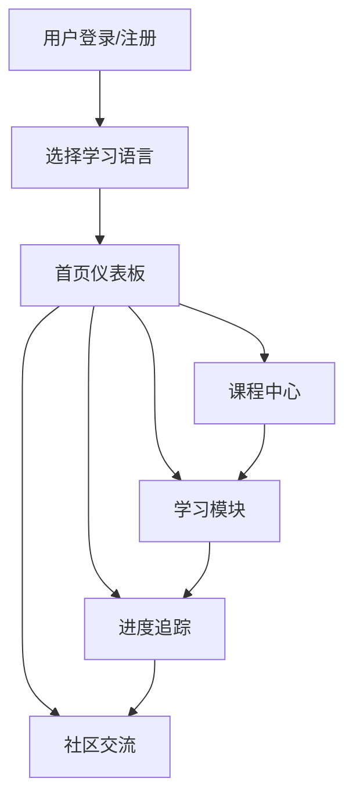

## 1. Product Overview

多语种学习在线教育平台，提供沉浸式语言学习体验，支持英语、日语、韩语等主流语言的分级课程、互动练习、进度追踪和社区交流功能。

## 2. Core Features

### 2.1 User Roles
| Role | Registration Method | Core Permissions |
|------|---------------------|------------------|
| 普通用户 | 邮箱注册/登录 | 使用所有学习功能、管理个人进度、参与社区交流 |

### 2.2 Feature Module
1. **首页/仪表板**: 学习概览、进度展示、快速开始学习
2. **课程中心**: 分级课程体系、多语言选择
3. **学习模块**: 单词记忆、语法练习、口语跟读、听力训练
4. **进度追踪**: 学习数据可视化、成就系统
5. **社区交流**: 论坛、学习动态分享
6. **个人中心**: 用户信息、学习偏好设置
7. **登录/注册**: 用户认证模块

### 2.3 Page Details
| Page Name | Module Name | Feature description |
|-----------|-------------|---------------------|
| 首页 | Hero区域 | 平台介绍、语言选择、快速开始按钮 |
| 首页 | 学习概览 | 今日学习时长、连续学习天数、进度条 |
| 首页 | 推荐课程 | 个性化推荐课程卡片 |
| 课程中心 | 语言选择 | 英语、日语、韩语等语言切换 |
| 课程中心 | 课程列表 | 分级课程展示（初级、中级、高级） |
| 学习模块 | 单词记忆 | 闪卡模式、拼写测试、发音功能 |
| 学习模块 | 语法练习 | 选择题、填空题、实时反馈 |
| 学习模块 | 口语跟读 | 录音对比、发音评分 |
| 学习模块 | 听力训练 | 听力材料、问答练习 |
| 进度追踪 | 数据图表 | 学习时长、掌握单词数曲线图表 |
| 进度追踪 | 成就系统 | 徽章展示、成就解锁 |
| 社区交流 | 帖子列表 | 用户分享、评论互动 |
| 个人中心 | 用户资料 | 头像、学习目标设置 |

## 3. Core Process

用户登录 → 选择学习语言 → 进入学习模块 → 完成练习 → 查看进度 → 获得成就 → 社区交流分享

## 4. User Interface Design

### 4.1 Design Style
- **主色调**: 深蓝紫渐变 (#6366f1 到 #8b5cf6) - 代表智慧与探索
- **辅助色**: 珊瑚橙 (#f472b6) 用于强调和交互元素
- **中性色**: 深灰 (#1f2937) 作为主文字，浅灰 (#f3f4f6) 作为背景
- **按钮风格**: 圆角矩形 (border-radius: 12px)，带有微妙阴影和悬停上浮效果
- **字体**: Playfair Display (标题) + Inter (正文)
- **布局风格**: 卡片式布局，充足留白，不对称网格
- **图标风格**: 线性图标，使用 lucide-react 库

### 4.2 Page Design Overview
| Page Name | Module Name | UI Elements |
|-----------|-------------|-------------|
| 首页 | Hero区域 | 大型渐变背景，居中卡片式布局，动画入场效果 |
| 课程中心 | 课程卡片 | 悬浮阴影，hover时上移，进度条指示器 |
| 学习模块 | 练习界面 | 大交互区域，即时视觉反馈，进度环形图 |
| 进度追踪 | 数据展示 | 渐变图表，动画加载，徽章展示墙 |
| 个人中心 | 资料卡片 | 圆形头像，表单式布局，柔和阴影 |

### 4.3 Responsiveness
- 桌面端优先设计 (1024px+)
- 平板端适配 (768px-1024px)
- 移动端适配 (375px-768px)
- 触摸优化的交互元素大小

### 4.4 Visual Effects
- 页面加载时的元素顺序淡入动画
- 卡片悬停时的微妙上浮和阴影加深
- 学习完成时的庆祝动效
- 进度变化的平滑过渡
- 深色模式支持
